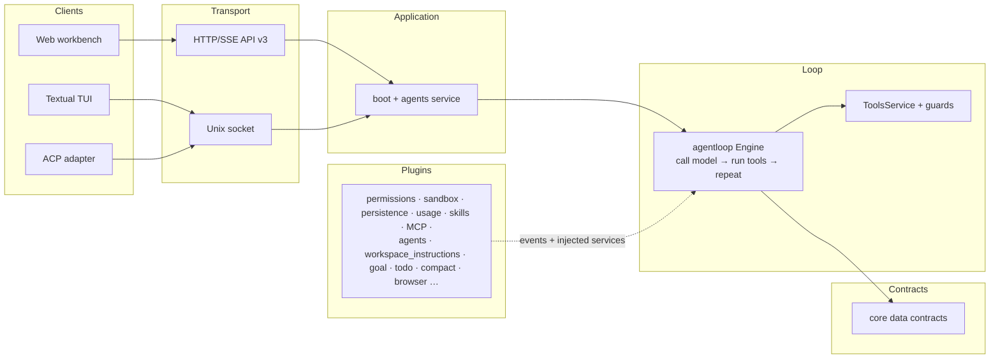

# XBotv2

**A readable, plugin-extensible client/server agent runtime.**

XBotv2 is a from-scratch AI agent runtime built around one rule: the agent
loop only does three things — **call the model, run the returned tools,
repeat**. Everything else lives in plugins that communicate through events
and injected services, never by reaching into the loop.


## Highlights

- **Minimal, readable core.** `agentloop/` owns the ReAct engine and the tool
  execution service; `core/` contains data contracts only. No framework DSL,
  no wrapper executors, no hidden state machines.
- **Plugin-first architecture.** A declarative `xcore.yaml` plugin tree plus
  global and workspace overlays. Plugins talk through events
  (`ctx.on(Events.X)`) and injected services (`ctx.tools`, `ctx.agents`,
  `ctx.permissions`, …); cross-plugin imports are enforced by an
  architecture check script.
- **Explicit permission and sandbox.** `allow` / `ask` / `deny` rules with
  parameter and resolved-path regexes are the approval channel; a
  Bubblewrap-based sandbox is a fail-closed enforcement backstop. The two
  never get merged.
- **Unified filesystem tools.** `read`, `edit`, `path`, and `search` cover
  UTF-8, binary, media, diffs, path operations, and search — one permission
  path per concrete operation.
- **One job lifecycle for background work.** Background shell commands and
  subagents share a single `JobRegistry` with `wait` / `read` / `cancel`.
- **Workspace-native.** `AGENTS.md` is read for every model request,
  `<workspace>/.agents/*.md` define workspace Agents, and
  `<workspace>/.xbot/plugins.yaml` overlays the plugin tree — all owned by
  the `workspace_instructions` plugin.
- **Multiple clients, one protocol.** Textual TUI, Web workbench, terminal,
  and an Agent Client Protocol (ACP v1) adapter over the same HTTP/SSE
  (protocol v3) transport.
- **Provider-neutral adapters.** MiniMax, OpenAI, Anthropic, LM Studio, and
  Mock behind one normalized `Message` / `ModelResponse` contract.
- **Evaluation-driven.** A HarnessBench (104 tasks) + Inspect harness with
  per-commit result archives drives iteration instead of "tests are green".

## Quick start

```bash
# install the workspace (Python 3.11+, uv)
uv sync

# interactive TUI client
uv run xbot tui --workspace ./output

# one-shot: run one prompt through the full loop and exit
uv run xbot once --provider minimax "Hello"

# HTTP/SSE API server
uv run xbot serve

# web workbench (build the frontend first: cd XBotv2/web && npm run build)
uv run xbot web

# Agent Client Protocol adapter
uv run xbot acp
```

`xbot once` is non-interactive: `ask_user` and `request_permission` are
hidden, and permission rules that require confirmation fail closed instead of
waiting forever. Run `uv run xbot --help` for every mode and option.

## Configuration

Runtime data defaults to `~/.xbot` (`XBOT_DATA_DIR` / `XBOT_HOME` /
`--data-dir` override it); the workspace defaults to the startup directory;
the provider defaults to `minimax`. On first run XBotv2 seeds the global user
tree into `<data-dir>/config/plugins.yaml`, which overlays the bundled
`xcore.yaml` tree.

```text
~/.xbot/                         # default runtime data
├── config/plugins.yaml          # global user tree overlay (seeded on first run)
└── sessions/<session-id>/threads/<thread>/...

<workspace>/
├── AGENTS.md                    # workspace instructions, read per request
├── .agents/*.md                 # workspace Agent definitions
└── .xbot/plugins.yaml           # workspace plugin overlay
```

Provider definitions live in the `llm` plugin's tree config; sessions,
message history (`messages.jsonl`), usage, and artifacts are stored per
thread and are resumable.

## Architecture



Core never imports a plugin; plugins import the stable `XBotv2.core`
contracts and reach runtime capabilities through injected services. The
composition root (`application/`) only supplies launcher facts, mounts the
plugin tree, and asks the agents service to create the engine — it does not
build Agent internals.

## Plugins

Everything beyond the loop is a plugin: `permissions`, `sandbox`,
`permission_request` (approval), `persistence`, `usage`, `compact`,
`interactions`, `skills`, `mcp`, `agents`, `goal`, `todolist`, `browser`,
`token_manager`, `content_cache`, and `workspace_instructions` — wired by the
plugin tree in `xcore.yaml`. Workspace extensions and Agent definitions are
discovered by `workspace_instructions`, so a same-named workspace Agent
overrides built-ins and data-root definitions.

## Tool system

The `agentloop` tool service registers, guards, validates, and dispatches
tools. Tool owners capture their own invocation dependencies; the executor
never looks up permissions, sandbox, approval, or job services. Built-in
tools include the merged filesystem quartet (`read` / `edit` / `path` /
`search`), shell with background jobs, `ask_user`, `send_message`,
`request_permission`, and the subagent suite (`spawn_subagent` /
`wait_subagent` / `read_subagent` / `cancel_subagent`). Skills (SKILL.md) and
MCP servers register tools through the same registry.

## Development

```bash
uv run pytest                # XBotv2 suite (700+ tests)
uv run pytest XCore/tests -q # plugin runtime suite
PYTHONPATH=.:XCore uv run python scripts/check_architecture.py
```

The architecture check fails when loop/tool code crosses plugin ownership
boundaries — run it before committing refactors. Documentation starts at
[`XBotv2/docs/README.md`](XBotv2/docs/README.md), with the
[architecture](XBotv2/docs/architecture.md), [plugin
system](XBotv2/docs/plugins/plugins.md), [tools](XBotv2/docs/tools/tools.md),
and [wire protocol](XBotv2/docs/protocol/protocol.md) as the main entry
points.

## License

No license is declared for this repository yet. Contact the maintainers
before reusing or redistributing the code.
