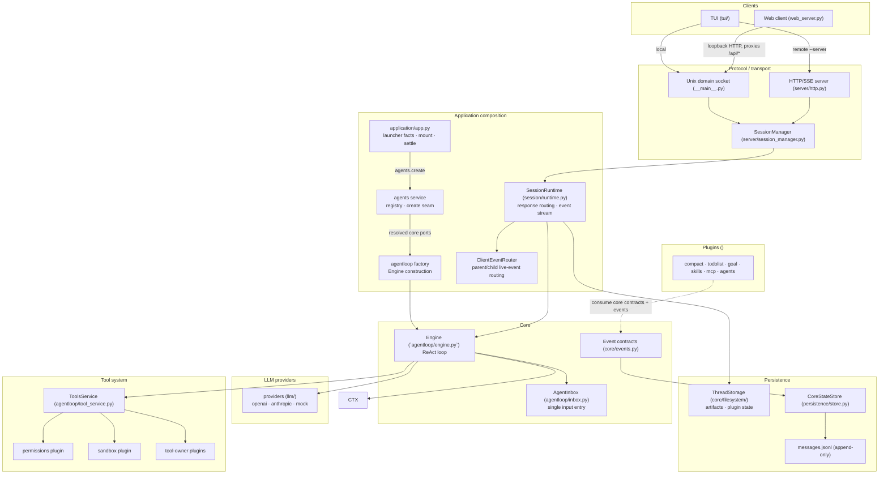

# XBotv2 Architecture

## Overview

XBotv2 is a plugin-extensible AI agent runtime. The agent-loop package owns
only the ReAct cycle and its tool-execution service: call the model, execute
the returned tools, and repeat. `core/` contains shared data contracts.
Permissions, sandboxing, interactions, persistence, providers, protocol, and
individual tool implementations remain separately owned capabilities.

## Architecture Principle

```text
Plugins -> import -> core data contracts
Plugins -> communicate -> injected services or events
Agent loop -> never imports -> concrete plugins
```

Core defines interfaces; application startup wires plugins from manifests.
`plugin_dirs=[]` disables plugin discovery (pure-core test mode).
`--no-plugins` CLI flag equivalent.

### System Architecture



Core never imports the built-in plugins; plugins import the stable `api`
surface. The Web boundary never imports or calls Engine — it only transports
public protocol requests.

## Client Processes

The TUI and Web clients use the same HTTP/SSE protocol. Local TUI mode talks
directly to an automatically managed UDS. Local Web mode adds a small loopback
HTTP boundary because browsers cannot open Unix sockets: it serves the compiled
`web_dist` assets and proxies `/api/*` to the UDS. This Web boundary does
not import or call Engine; it only transports public protocol requests.

Vite and npm are build dependencies, not runtime processes. `npm run build`
writes ignored hashed assets to `web_dist`; `xbotv2 web` serves an
existing local build without invoking Node.

## Runtime Identity

```yaml
session_id: generated-or-explicit
thread_id: agent
workspace_root: /actual/project/root
provider: current-provider
```

Configuration:

```text
XBotv2/xcore.yaml                # bundled default plugin tree (single document)
<data_dir>/config/plugins.yaml   # global user tree overlay (seeded on first run)
<data_dir>/config/config.yaml    # runtime Agent settings/policy
<data_dir>/sessions/<session-id>/threads/<thread>/thread.yaml
<workspace_root>/AGENTS.md       # reloaded for each model context build
<workspace_root>/.agents/*.md    # workspace Agent definitions (discovered by workspace_instructions)
<workspace_root>/.xbot/plugins.yaml
<workspace_root>/.xbot/config.yaml
```

`data_dir` defaults to `~/.xbot` (`--data-dir` / `XBOT_DATA_DIR` overrides).
The bundled `xcore.yaml` is the default tree; the global
`<data_dir>/config/plugins.yaml` overlay and the workspace
`.xbot/plugins.yaml` overlay patch it (config deep-merged, later wins).  On
first run the global user tree is written if missing (DSH-style boot seed),
so users edit that file instead of the bundled tree.  Provider definitions
are the ``llm`` plugin's tree config (``default`` + ``providers``) and the
user context is the ``config`` plugin's tree config (``user``) — there are no
separate ``providers.yaml`` / ``user.yaml`` documents. Provider definitions
use explicit `max_context_tokens` and `max_output_tokens`. Any unknown
provider name fails during application startup; provider selection never
silently falls back to a different model. Agent settings such as provider
selection, instructions, tool selectors, and policy are resolved by
`ctx.settings`; they are not copied through an application config plugin.

The agents service resolves that selection through the mounted config and LLM
services, then passes provider-neutral core ports to the registered agentloop
factory. The LLM plugin owns the mutable `ctx.model` binding; Engine and
auxiliary model capabilities consume that port, while `ctx.llm` remains the
provider route directory.

The session service creates thread paths, `LoopState`, and the neutral
`ThreadStorage` used for artifacts and plugin-local files. Message persistence
is a separate optional projection: it hydrates `LoopState` when mounted and
observes state changes, but sandbox, caches, tools, uploads, and usage do not
depend on it. The default application mounts persistence; a profile may disable
it for an in-memory conversation without disabling other capabilities.

## Core Components

### Engine (`agentloop/engine.py`)

ReAct loop: user message accept → context build (with hook injection) →
LLM call (streaming) → tool execution → repeat. Uses the provider-neutral
`Message`, `ToolCall`, and `Tool` contracts from `core`.

The turn implementation is an orchestrator over stage-specific methods:
message admission/start, context construction, model-request preparation,
streamed model handling, tool-batch execution, and turn finish. Each method
interprets only the events it owns; there is no shared catch-all event result
interpreter. Internal model/tool completion records are consumed by the
orchestrator and never cross the C/S event boundary.

Key hooks: `BEFORE_USER_MESSAGE_ACCEPT`, `AFTER_CONTEXT`, `BEFORE_MODEL_REQUEST`,
`AFTER_AGENT`, `BEFORE_TOOLS`, `ON_STOP`, and `ON_STOP_FAILURE`. Compact owns
its own `PRE_COMPACT`/`POST_COMPACT` transaction; persistence observes the
neutral `STATE_CHANGED` event.

### Tool System (`agentloop/tool_*.py`)

- **Tool** (`core/tools.py`): native tool dataclass with `from_function()`, supports
  async functions and keyword-only parameter injection (sandbox, skill_registry).
- **ToolRegistry** (`registry.py`): namespace-aware canonical names and
  `restrict()` with wildcard selectors.
- **SandboxPolicy** (`sandbox.py`): integrates **BubblewrapBackend** (`sandbox_bwrap.py`)
  for process isolation. Provides capability methods: `run_shell`, `read_file`,
  `write_file`, `list_dir`.
- **PermissionSystem** (`permissions.py`): deny/allow/ask with regex pattern matching.

### Job System (`core/jobs.py`, `jobs/`)

Background shells and subagents share one unified job lifecycle. `JobRegistry`
owns IDs, status transitions, waiting, cancellation, output storage, and
cleanup for every kind; it is the only runtime entity for this subsystem.
Kind-specific adapters implement a `JobRunner` and the typed, model-facing
tools: the shell tools (`shell` with `background=true`, `list_shells`, `wait_shell`,
`read_shell`, `cancel_shell`) live in `core/builtin_tools/shell.py`, and the
subagent tools (`spawn_subagent`, `list_subagents`, `wait_subagent`,
`read_subagent`, `cancel_subagent`) live in the `agents` plugin. The model never
sees a generic `task`/`job` tool. List and wait responses carry only lightweight
metadata; bulk output is read through the explicit `read_*` tools, each bounded
by character limits. The application-owned `ChildApplications` service starts
and closes child Agent applications and returns the core `AgentSession`
contract; `session/` keeps only session identity and the child hierarchy.

### Runtime events (`core/events.py`)

The engine and tool layer dispatch named events on the XCore context
(`ctx.serial` for short-circuit events whose first non-`None` result is
interpreted by the caller, `ctx.emit` for observer events). Plugins observe
and intercept them with `ctx.on(Events.X, handler)`; the payload is an
`EventContext`.

### Unified input (`agentloop/inbox.py`)

The concrete loop owns the only model-visible input queue. User messages,
steering input, goal continuations, and runtime notifications all enter via
`send(target, wakeup)`. Fixed aliases mirror DSH: `followup` is
`next-turn + wake`, `steer` is `next-step + wake`, and `inject` is
`next-step + no wake`. Session transport retains only reply waiters keyed by
message ID. Inbox splices are journaled before the live projection mutates and
are replayed on resume.

```mermaid
sequenceDiagram
    participant Job as background job (shell / subagent)
    participant Reg as JobRegistry (jobs/)
    participant Ses as SessionRuntime (session/runtime.py)
    participant IBX as AgentInbox
    participant Loop as agent loop
    participant TUI
    participant Goal as GoalPlugin

    Note over Job,IBX: Completions never start a turn
    Job-->>Reg: finishes
    Reg-->>Ses: JOB_COMPLETED event
    Ses->>IBX: inject(notification)
    Ses-->>TUI: completion_notice (task panel tracks status)

    Note over Loop,IBX: inject does not wake an idle loop
    Ses->>IBX: followup(user message)
    Loop->>IBX: claim next-step + one next-turn
    IBX-->>Loop: notification + user message

    Note over Goal,IBX: goal continuation uses the same entry
    Goal->>IBX: followup(goal continuation)
    IBX->>Loop: wake driver
```

### LLM Provider (`llm/`)

Configured providers are adapter instances: `protocol` selects the protocol
implementation, the endpoint/credentials identify the vendor, and the `models`
catalog carries per-model sampling, capacity, and capability settings. The
LLM interface is constructed as protocol implementation → adapter instance →
the selected model config.

- `BaseProvider`: common Provider configuration, immutable Tool binding, and
  normalized streaming contract.
- `OpenAICompatibleProvider`: streaming (`stream=True`); optional per-model
  `temperature` / `reasoning_effort` / `thinking` config, serialized to the
  vendor wire format. Owns OpenAI message, Tool call, and usage conversion.
- `AnthropicProvider`: owns Anthropic message blocks, Tool schemas, streaming
  events, and usage conversion behind the same interface.
- `client.py`: Provider configuration factory only.
- `MockLLM`: deterministic test provider, supports chunk streaming with
  `additional_kwargs`.
- `Message` dataclass (`api/messages.py`): XBot-owned, persisted to `messages.jsonl`.

The usage capability accumulates normalized usage across a session and owns
its thread-local snapshot. Persistence stores provider-neutral messages;
neither capability interprets native provider payloads or depends on the
other's storage.

### Context Builder (`core/context.py`)

Assembles source-tagged context components into one leading XML-delimited system
message followed by provider-neutral history. Core, runtime, Agent, workspace,
plugin, memory, and dynamic state remain visibly distinct, and all injected text
and metadata is escaped. Fragment stages are compatible ordering zones rather
than provider positions or authority levels. The default core instructions are
owned by `ContextBuilder` and apply to primary Agents and subagents; clocks and
turn counters are excluded to keep the provider prefix deterministic. See
[`prompts.md`](core/prompts.md) for the complete contract.

Runtime-owned non-system content uses the same source-delimited convention
inside its existing role: Tool results, cache references, Skill expansion,
Mailbox events, and Compact summaries are structured without promoting them to
system messages.

## Plugin System

### CompactPlugin (`compact/`)

Observes context pressure and uses its injected LLM service to summarize a
completed history prefix. It owns pre/post bracketing, core-history replacement,
and `STATE_CHANGED`; persistence independently records the checkpoint.

### TodolistPlugin (`todolist/`)

Provides one atomic `update_todos` Tool that replaces the complete ordered
checklist after validation. One `ctx.state.namespace(...)` value holds the active items;
Tool calls and results use the normal conversation path without a repeated
context event. It does not infer state from conversation text or duplicate goal
ownership.

### GoalPlugin (`goal/`)

Persists one session objective. Humans manage it through `/goal`; the Agent uses
`create_goal`, `get_goal`, and `update_goal`. Both surfaces reuse plugin-owned
state transitions but have separate dispatch paths. Active goals schedule their
next continuation turn until completed, blocked, or paused. Goal Tools use the
same schema, sandbox, and permission guard pipeline as every other Tool; Core
contains no Goal-specific permission or command logic. It does not own todo
steps.

### SkillsPlugin (`skills/`)

Discovers SKILL.md files (agentskills.io standard) from:
`.claude/skills/`, `.agents/skills/`, `.opencode/skills/` (project + global `~/.`).

- Registers each discovered skill once through the stable `Tool` API
  (namespace `skills:<scope>:<name>`)
- BEFORE_USER_MESSAGE_ACCEPT hook: detects `/skill-name` prefix, expands SKILL.md content
- Shell injection via `` !`cmd` `` syntax in SKILL.md (sandboxed)
- standard `allowed-tools` metadata and namespaced
  `xbotv2-disallowed-tools` monotonic restrictions; neither bypasses the
  authoritative permission guard
- `disable-model-invocation: true` for skills available only through explicit
  `/skill-name` user invocation
- `user-invocable: false` for model-only skills and a bounded provider metadata
  budget for Skill descriptions

### MCPPlugin (`mcp/`)

Connects through the official MCP SDK using stdio or Streamable HTTP.
- The SDK owns lifecycle negotiation, pagination, cancellation, progress, and
  server notifications.
- Registers MCP tools in ToolRegistry (namespace `mcp:<server>:<tool>`)
- Eager connection at Agent startup with per-server diagnostics. Optional failures
  mark the plugin degraded; servers configured with `required: true` fail startup.
- Performs the required initialize/initialized handshake before discovery
- Preserves MCP input schemas and adapts call data/errors to `ToolResult`
- Keeps optional server and client features capability-gated; XBot advertises
  them only when the corresponding Agent bridge is installed.
- Exposes resources, prompts, and completion through one stable bridge tool per
  negotiated feature instead of dynamically registering every remote item.

## Namespaces And Commands

Tool registry identities remain namespaced internally (`plugin:`, `skills:`,
and `mcp:`) while provider-visible Tool names stay unique. Slash commands use a
separate human-facing registry and are discovered by command name, usage, kind,
and description. A Tool namespace is never interpreted as a slash-command path.

## Transport

### HTTP/SSE (`server/http.py`)

FastAPI app with SSE streaming. The central `protocol/` package owns only the
version, hello/health/error contracts, and SSE envelope/framing. Each business
plugin owns its C/S wire models and FastAPI mapping in `<cap>/protocol.py` and
registers its router through the typed XCore `http/route` event. The server
carrier imports no business plugin, keeps no Session manager in `app.state`,
and exposes no route-registration service locator. `SessionManager` owns one
`SessionRuntime` per
live thread. It owns the XCore application, Engine handle, turn task,
client-event sink, and event stream; the agent inbox belongs to Engine. Runtime
stops active delivery before stopping the application and plugin fibers.
Once mode uses the same runtime so immediate Goal continuations are not lost
after the first model turn.
Business wire DTOs are owned by their plugins; `core/` contains no transport
types.
The HTTP bridge owns the Engine async stream and closes it when the SSE
consumer completes or disconnects.

### Unix Domain Socket (`__main__.py`)

Default TUI transport: auto-generates `/tmp/xbotv2-{pid}.sock`, spawns server
subprocess bound to it. No TCP port needed for local use. `--server URL` for
remote HTTP connection.

### Session Resume

Session creation uses explicit `new` and `resume` modes. The server does not
silently change the requested mode. Resume closes any in-memory runtime with the
same session id and rebuilds from persisted history; pending interactions and
turn coroutines are connection-owned and are never restored.

## Unified Command System

Every executable slash command is registered by the plugin that owns it:
the LLM component registers `/provider` `/model` `/effort`, the agents
plugin `/agent`, session `/status` `/clear` `/undo` `/fork` `/reload`
(system soft restart), jobs `/tasks` `/task`, permissions `/permission`,
and sandbox `/sandbox` — all into the shared `ctx.commands` registry.
`GET/POST
/sessions/{sid}/threads/{tid}/commands` is the only command wire: clients
discover the merged catalog and execute any command; results are detached
notices that never enter model history.  UI-local commands
(`exit` `help` `thinking` `details` `attach` `clear-screen`) stay
client-side.  Plugins register human commands and Agent Tools as separate
capabilities that may reuse private business methods.  Ordinary model and
MCP Tools do not become slash commands.

`application/` owns only startup/assembly; per-domain logic lives in plugin
services and command handlers resolve those services at runtime.
`core.commands` translates use-case failures into command results.  A
system soft restart is the `SOFT_RELOAD` event: `/reload` (session) and
`/agent reload` emit it, the LLM service validates its merged catalog
fail-closed first, the loader re-applies the external tree layer, the
agents service rebinds the active model, and workspace_instructions
re-reads its workspace sources.  Machine clients (SDK/ACP) keep using the
typed resource endpoints; human UIs use the command plane only, so the
TUI, Web, and future clients share one command model.

## Persistence

```
data/sessions/<sid>/
├── config.yaml             # session configuration and approvals
├── threads.jsonl           # parent/child Agent lifecycle journal
└── threads/<thread-id>/
    ├── thread.yaml         # selected Agent, Provider, and parent thread
    └── state/
        ├── messages.jsonl  # append-only Messages and history operations
        ├── usage.yaml      # thread-local provider usage
        ├── plugin_states/  # thread-local per-plugin YAML state
        └── artifacts/      # cached tool outputs and provider context
```

No `events.jsonl` or `state.yaml`. `CoreStateStore` appends normal Messages,
Compact checkpoints, Undo/Clear stack operations, and Mailbox delivery records.
`read_messages()` materializes current provider history from the last checkpoint
forward without rewriting or deleting prior interaction records.
Each Message record stores one ordered `parts` list containing text, reasoning,
image references, and Tool calls. Derived `content` and `tool_calls` fields are
not duplicated in the journal. Image bytes live once under
`artifacts/media/`; history stores only the session-relative reference.

## Streaming & Reasoning

Providers use `stream=True` with `async for chunk in response`. Text and
reasoning are separate provider-neutral stream fields and separate Message
parts. OpenAI-compatible reasoning extensions are recorded but are not added to
later Chat Completions requests. Anthropic thinking and redacted-thinking
blocks retain the signature data required by the Messages protocol and are
replayed unchanged in subsequent Anthropic Messages requests.

TUI uses timer-based rendering (`_stream_timer` at 50ms intervals) —
streaming events are near-zero-cost on the hot path.
