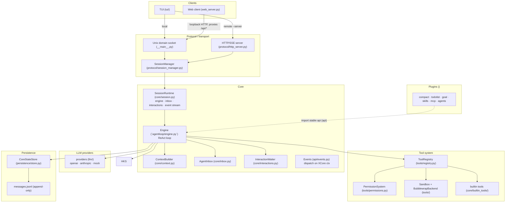
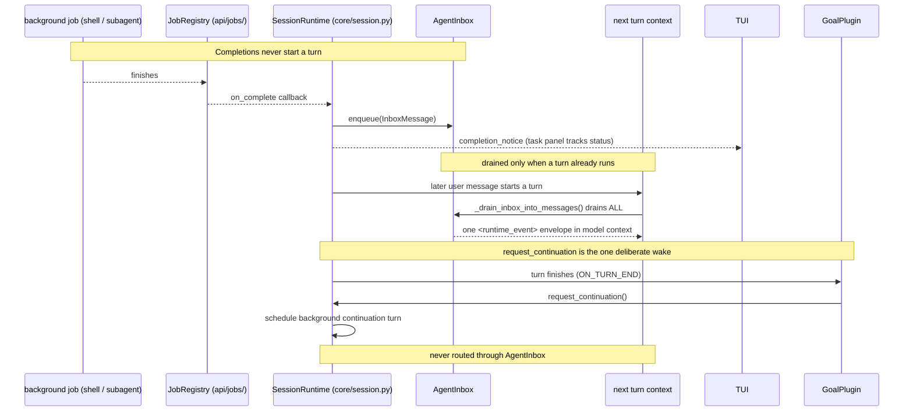

# XBotv2 Architecture

## Overview

XBotv2 is a plugin-extensible AI agent runtime with a minimal core ReAct loop.
The core owns provider calls, tool execution, permissions, sandboxing (BubblewrapBackend),
protocol streaming (HTTP/SSE + Unix domain socket), and append-only persistence
(`messages.jsonl`). Skills, MCP tools, and plugin extensions live in ``.

## Architecture Principle

```text
Plugins -> import -> Stable API (api)
Core -> never imports -> Plugins (goal/, todolist/, skills/, ...)
```

Core defines interfaces; bootstrap wires plugins at runtime via manifests.
`plugin_dirs=[]` disables plugin discovery (pure-core test mode).
`--no-plugins` CLI flag equivalent.

### System Architecture



Core never imports the built-in plugins; plugins import the stable `api`
surface. The Web boundary never imports or calls Engine — it only transports
public protocol requests.

## Client Processes

The TUI and Web clients use the same HTTP/SSE protocol. Local TUI mode talks
directly to an automatically managed UDS. Local Web mode adds a small loopback
HTTP boundary because browsers cannot open Unix sockets: it serves the compiled
`web_dist` assets and proxies `/api/*` to the UDS. This Web boundary does
not import or call Engine; it only transports public protocol requests.

Vite and npm are build dependencies, not runtime processes. `npm run build`
writes ignored hashed assets to `web_dist`; `xbotv2 web` serves an
existing local build without invoking Node.

## Runtime Identity

```yaml
session_id: generated-or-explicit
thread_id: agent
workspace_root: /actual/project/root
provider: current-provider
```

Configuration:

```text
XBotv2/xcore.yaml                # bundled default plugin tree (single document)
<data_dir>/config/plugins.yaml   # global user tree overlay (seeded on first run)
<data_dir>/sessions/<session-id>/threads/<thread>/thread.yaml
<workspace_root>/AGENTS.md       # reloaded for each model context build
<workspace_root>/.agents/*.md    # workspace Agent definitions (override built-ins)
<workspace_root>/.xbot/plugins.yaml
```

`data_dir` defaults to `~/.xbot` (`--data-dir` / `XBOT_DATA_DIR` overrides).
The bundled `xcore.yaml` is the default tree; the global
`<data_dir>/config/plugins.yaml` overlay and the workspace
`.xbot/plugins.yaml` overlay patch it (config deep-merged, later wins).  On
first run the global user tree is written if missing (DSH-style boot seed),
so users edit that file instead of the bundled tree.  Provider definitions
are the ``llm`` plugin's tree config (``default`` + ``providers``) and the
user context is the ``config`` plugin's tree config (``user``) — there are no
separate ``providers.yaml`` / ``user.yaml`` documents. Provider definitions
use explicit `max_context_tokens` and `max_output_tokens`. Any unknown
provider name fails at bootstrap; provider selection never silently falls
back to a different model.

## Core Components

### Engine (`agentloop/engine.py`)

ReAct loop: user message accept → context build (with hook injection) →
LLM call (streaming) → tool execution → repeat. Uses the provider-neutral
`Message`, `ToolCall`, and `Tool` types from `api`.

The turn implementation is an orchestrator over stage-specific methods:
message admission/start, context construction, model-request preparation,
streamed model handling, tool-batch execution, and turn finish. Each method
interprets only the events it owns; there is no shared catch-all event result
interpreter. Internal model/tool completion records are consumed by the
orchestrator and never cross the C/S event boundary.

Key hooks: `BEFORE_USER_MESSAGE_ACCEPT`, `AFTER_CONTEXT`, `BEFORE_MODEL_REQUEST`,
`AFTER_AGENT`, `BEFORE_TOOLS`, `ON_STOP`, `ON_STOP_FAILURE`, `ON_TOOL_CALL_FAILURE`,
`PRE_COMPACT`, `POST_COMPACT`.

### Tool System (`tools/`)

- **Tool** (`api/tools.py`): native tool dataclass with `from_function()`, supports
  async functions and keyword-only parameter injection (sandbox, skill_registry).
- **ToolRegistry** (`registry.py`): namespace-aware canonical names and
  `restrict()` with wildcard selectors.
- **SandboxPolicy** (`sandbox.py`): integrates **BubblewrapBackend** (`sandbox_bwrap.py`)
  for process isolation. Provides capability methods: `run_shell`, `read_file`,
  `write_file`, `list_dir`.
- **PermissionSystem** (`permissions.py`): deny/allow/ask with regex pattern matching.

### Job System (`api/jobs/`)

Background shells and subagents share one unified job lifecycle. `JobRegistry`
owns IDs, status transitions, waiting, cancellation, output storage, and
cleanup for every kind; it is the only runtime entity for this subsystem.
Kind-specific adapters implement a `JobRunner` and the typed, model-facing
tools: the shell tools (`start_shell`, `list_shells`, `wait_shell`,
`read_shell`, `cancel_shell`) live in `core/builtin_tools/shell.py`, and the
subagent tools (`spawn_subagent`, `list_subagents`, `wait_subagent`,
`read_subagent`, `cancel_subagent`) live in the `agents` plugin. The model never
sees a generic `task`/`job` tool. List and wait responses carry only lightweight
metadata; bulk output is read through the explicit `read_*` tools, each bounded
by character limits. Child Engine sessions are spawned through the api
`AgentRuntime`/`AgentSession` protocols, implemented in `core/agents.py`.

### Runtime events (`api/events.py`)

The engine and tool layer dispatch named events on the XCore context
(`ctx.serial` for short-circuit events whose first non-`None` result is
interpreted by the caller, `ctx.emit` for observer events). Plugins observe
and intercept them with `ctx.on(Events.X, handler)`; the payload is an
`EventContext`.

### Input acceptance and runtime inbox (`core/inbox.py`)

While the agent is busy, new user input is held in the session's pending fold
and fused into the running turn after the next ToolResult batch; a held input
that no boundary fuses is rejected with `input_rejected` and the client
retries. Runtime notifications are staged in the agent inbox and drained —
all at once — into the next turn's context without starting a turn. Both
buffers are runtime-only and destroyed on disconnect.



### LLM Provider (`llm/`)

- `BaseProvider`: common Provider configuration, immutable Tool binding, and
  normalized streaming contract.
- `OpenAICompatibleProvider`: streaming (`stream=True`) with `reasoning_effort` and
  `thinking_enabled` config. Owns OpenAI message, Tool call, and usage conversion.
- `AnthropicProvider`: owns Anthropic message blocks, Tool schemas, streaming
  events, and usage conversion behind the same interface.
- `client.py`: Provider configuration factory only.
- `MockLLM`: deterministic test provider, supports chunk streaming with
  `additional_kwargs`.
- `Message` dataclass (`api/messages.py`): XBot-owned, persisted to `messages.jsonl`.

Core accumulates normalized usage across a session and decides whether a call
updates the active context reading. Persistence stores Provider-neutral
messages; neither layer interprets native Provider payloads.

### Context Builder (`core/context.py`)

Assembles source-tagged context components into one leading XML-delimited system
message followed by provider-neutral history. Core, runtime, Agent, workspace,
plugin, memory, and dynamic state remain visibly distinct, and all injected text
and metadata is escaped. Fragment stages are compatible ordering zones rather
than provider positions or authority levels. The default core instructions are
owned by `ContextBuilder` and apply to primary Agents and subagents; clocks and
turn counters are excluded to keep the provider prefix deterministic. See
[`prompts.md`](core/prompts.md) for the complete contract.

Runtime-owned non-system content uses the same source-delimited convention
inside its existing role: Tool results, cache references, Skill expansion,
Mailbox events, and Compact summaries are structured without promoting them to
system messages.

## Plugin System

### CompactPlugin (`compact/`)

Uses the public `BEFORE_CONTEXT` compaction result and the controlled
`EventContext.invoke_model()` capability to summarize a completed history
prefix. It supports a model-visible request tool and a configurable automatic
character threshold. Core remains responsible for event bracketing and atomic
history persistence.

### TodolistPlugin (`todolist/`)

Provides one atomic `update_todos` Tool that replaces the complete ordered
checklist after validation. One `ctx.state.namespace(...)` value holds the active items;
Tool calls and results use the normal conversation path without a repeated
context event. It does not infer state from conversation text or duplicate goal
ownership.

### GoalPlugin (`goal/`)

Persists one session objective. Humans manage it through `/goal`; the Agent uses
`create_goal`, `get_goal`, and `update_goal`. Both surfaces reuse plugin-owned
state transitions but have separate dispatch paths. Active goals schedule their
next continuation turn until completed, blocked, or paused. Goal
preapproves its basic Agent Tools through `BEFORE_TOOL_CALL`; Core contains no
Goal-specific permission or command logic. It does not own todo steps.

### SkillsPlugin (`skills/`)

Discovers SKILL.md files (agentskills.io standard) from:
`.claude/skills/`, `.agents/skills/`, `.opencode/skills/` (project + global `~/.`).

- Registers each discovered skill once through the stable `Tool` API
  (namespace `skills:<scope>:<name>`)
- BEFORE_USER_MESSAGE_ACCEPT hook: detects `/skill-name` prefix, expands SKILL.md content
- Shell injection via `` !`cmd` `` syntax in SKILL.md (sandboxed)
- standard `allowed-tools` preapproval and namespaced
  `xbotv2-disallowed-tools` restrictions, applied before the authoritative core
  permission check
- `disable-model-invocation: true` for skills available only through explicit
  `/skill-name` user invocation
- `user-invocable: false` for model-only skills and a bounded provider metadata
  budget for Skill descriptions

### MCPPlugin (`mcp/`)

Connects through the official MCP SDK using stdio or Streamable HTTP.
- The SDK owns lifecycle negotiation, pagination, cancellation, progress, and
  server notifications.
- Registers MCP tools in ToolRegistry (namespace `mcp:<server>:<tool>`)
- Eager connection at bootstrap with per-server diagnostics. Optional failures
  mark the plugin degraded; servers configured with `required: true` fail startup.
- Performs the required initialize/initialized handshake before discovery
- Preserves MCP input schemas and adapts call data/errors to `ToolResult`
- Keeps optional server and client features capability-gated; XBot advertises
  them only when the corresponding Agent bridge is installed.
- Exposes resources, prompts, and completion through one stable bridge tool per
  negotiated feature instead of dynamically registering every remote item.

## Namespaces And Commands

Tool registry identities remain namespaced internally (`plugin:`, `skills:`,
and `mcp:`) while provider-visible Tool names stay unique. Slash commands use a
separate human-facing registry and are discovered by command name, usage, kind,
and description. A Tool namespace is never interpreted as a slash-command path.

## Transport

### HTTP/SSE (`protocol/http_server.py`)

FastAPI app with SSE streaming. `SessionManager` owns one core `SessionRuntime`
per live thread, grouped by session ID. `SessionRuntime` owns the Engine,
runtime-only Mailbox, turn task, interaction sink, and event stream; HTTP only
maps that lifecycle to wire requests. The Runtime is bound before Engine start
and stops active delivery before Engine-owned task managers and plugins close.
Once mode uses the same runtime so immediate Goal continuations are not lost
after the first model turn.
Wire DTOs are owned by `protocol/models.py`; `api/` contains no transport types.
The HTTP bridge owns the Engine async stream and closes it when the SSE
consumer completes or disconnects.

### Unix Domain Socket (`__main__.py`)

Default TUI transport: auto-generates `/tmp/xbotv2-{pid}.sock`, spawns server
subprocess bound to it. No TCP port needed for local use. `--server URL` for
remote HTTP connection.

### Session Resume

Session creation uses explicit `new` and `resume` modes. The server does not
silently change the requested mode. Resume closes any in-memory runtime with the
same session id and rebuilds from persisted history; pending interactions and
turn coroutines are connection-owned and are never restored.

## Unified Command System

Command metadata uses `client`, `server`, and `prompt` kinds. The TUI owns
client commands, fetches the session command catalog from the server, executes
server commands through the command endpoint, and submits prompt expansions
through the message endpoint. Plugins register human commands and Agent Tools
as separate capabilities that may reuse private business methods. Ordinary
model and MCP Tools do not become slash commands.

## Persistence

```
data/sessions/<sid>/
├── config.yaml             # session configuration and approvals
├── threads.jsonl           # parent/child Agent lifecycle journal
└── threads/<thread-id>/
    ├── thread.yaml         # selected Agent, Provider, and parent thread
    └── state/
        ├── messages.jsonl  # append-only Messages and history operations
        ├── usage.yaml      # thread-local provider usage
        ├── plugin_states/  # thread-local per-plugin YAML state
        └── artifacts/      # cached tool outputs and provider context
```

No `events.jsonl` or `state.yaml`. `CoreStateStore` appends normal Messages,
Compact checkpoints, Undo/Clear stack operations, and Mailbox delivery records.
`read_messages()` materializes current provider history from the last checkpoint
forward without rewriting or deleting prior interaction records.
Each Message record stores one ordered `parts` list containing text, reasoning,
image references, and Tool calls. Derived `content` and `tool_calls` fields are
not duplicated in the journal. Image bytes live once under
`artifacts/media/`; history stores only the session-relative reference.

## Streaming & Reasoning

Providers use `stream=True` with `async for chunk in response`. Text and
reasoning are separate provider-neutral stream fields and separate Message
parts. OpenAI-compatible reasoning extensions are recorded but are not added to
later Chat Completions requests. Anthropic thinking and redacted-thinking
blocks retain the signature data required by the Messages protocol and are
replayed unchanged in subsequent Anthropic Messages requests.

TUI uses timer-based rendering (`_stream_timer` at 50ms intervals) —
streaming events are near-zero-cost on the hot path.
