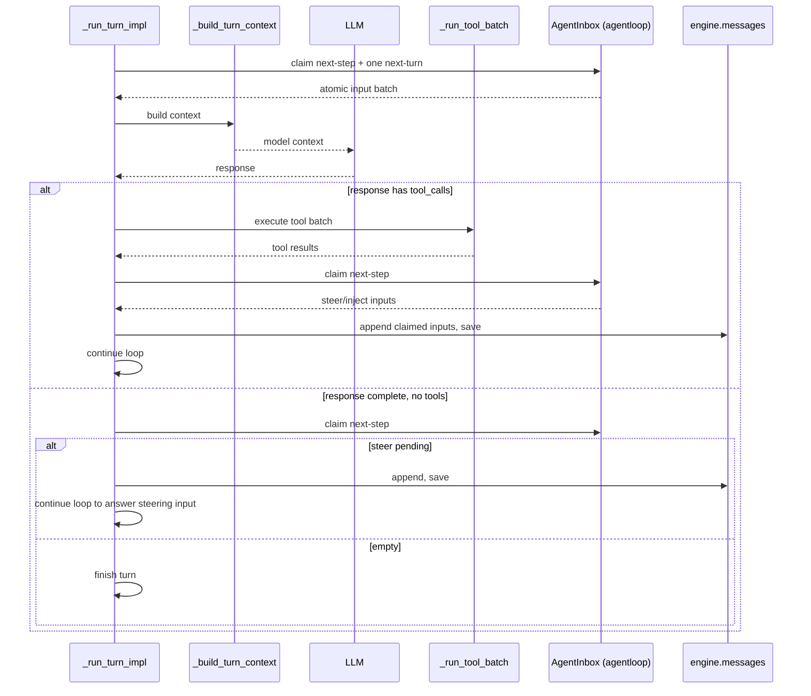

# XBotv2 Core Runtime

## Engine (`agentloop/engine.py`)

ReAct loop: user message → context → LLM → tools → repeat.
Uses XBot-owned `Message` dataclass exclusively. No LangChain dependency.

`_run_turn_impl()` coordinates explicit stage methods for message admission,
context construction, model-request preparation, streamed response handling,
tool batches, and turn finish. Stage-specific methods retain their own event
return rules; internal completion records are not protocol events.

### Turn loop and agent-owned inbox



`followup` appends to `next-turn` and wakes the driver; `steer` appends to
`next-step` and wakes it; `inject` appends to `next-step` without waking it.
Every mutation is durably recorded as `agent/inbox/spliced` before the live
FIFO projection changes. Protocol code may retain response waiters keyed by
message ID, but never duplicates message content in another queue.


### Streaming

Provider `stream=True` yields per-token `ModelChunk` objects.
Engine emits `assistant_message_delta` events for each content delta and
`tool_call_delta` for partial tool calls. Final response aggregated into
`ModelResponse` and emitted as an `assistant_message` event.

Timer-based TUI rendering (`_stream_timer` at 50ms intervals) ensures
per-token overhead is near-zero.

### Reasoning / Thinking

Provider adapters normalize reasoning into `ReasoningPart` values and Engine
emits it through the `reasoning` field of `assistant_message_delta`. OpenAI
Chat Completions requests do not receive non-standard reasoning fields.
Anthropic thinking and redacted-thinking blocks retain the protocol metadata
needed for exact replay; signed reasoning is never rewritten by context
externalization.

### Runtime events

Named events (`agentloop.events.Events`) cover the existing lifecycle: session
(`SESSION_START`/`SESSION_RESUME`/`SESSION_CLOSE`), turn
(`TURN_START`/`TURN_END`/`ON_STOP`/`ON_STOP_FAILURE`), user input
(`BEFORE_USER_MESSAGE_ACCEPT`/`AFTER_USER_MESSAGE_ACCEPT`), context building
(`BEFORE_CONTEXT`/`AFTER_CONTEXT`), model
(`BEFORE_MODEL_REQUEST`/`AFTER_MODEL_RESPONSE`), and
tools (`BEFORE_TOOLS`/`AFTER_TOOLS`/`BEFORE_TOOL_CALL`/`AFTER_TOOL_CALL`/
`PERMISSION_REQUEST`/`TOOL_CALL_FAILURE`).

Context construction events and their typed payloads are exported by
`XBotv2.context_builder`; compaction lifecycle events are exported by
`XBotv2.compact`. Application initialization and runtime output events are
exported by `XBotv2.application`.

Agent-loop short-circuit events are dispatched with `ctx.serial` and their
first non-`None` result is interpreted by the caller as a documented dictionary.
`BEFORE_TOOL_CALL` may only rewrite the `ToolCall` or its arguments; it cannot
allow, deny, stop, or synthesize a result. Observer events are dispatched with
`ctx.emit`; listeners must not return values. Failures in a short-circuit
listener propagate immediately; observer failures propagate out of `emit`.

Model preparation events expose `EventContext.model_request` as the public
mutable `ModelRequest` contract. Listeners update its `messages`, `tools`, or
`llm` attributes directly; changing `tools` automatically rebinds the provider
unless the listener also supplies a different model port.

### Compaction

The compact plugin observes `BEFORE_CONTEXT` or `BEFORE_MODEL_REQUEST`, runs
`PRE_COMPACT`, replaces core history, emits `POST_COMPACT` and the typed session
`HISTORY_CHANGED` event,
then requests a generic rebuild. Engine has no compaction branch or persistence
call.

## Tools

### Tool (`core/tools.py`)

```python
@dataclass(frozen=True)
class Tool:
    name: str
    description: str
    function: Callable
    parameters: dict          # JSON Schema
```

`from_function()` extracts docstrings and signatures. Supports async functions
via `ainvoke()`. Plugin-owned factories bind sandbox, jobs, interactions, and
other runtime services before registration. Core never injects those services.
A function may declare one keyword-only parameter annotated as `ToolCall`; it
is omitted from the model schema and receives the final call after rewrite
Hooks and before dispatch.

### ToolRegistry (`agentloop/tool_registry.py`)

Identity is the canonical registered name. Built-in core keys are bare (for
example `shell`); non-core examples include `plugin:skills:skill`,
`skills:global:find-skills`, and `mcp:github:search`.

`restrict()` supports canonical keys, namespace selectors such as
`skills:*` and `mcp:*`, and bare display-name fallbacks.

`get()` matches by both registry key and display name (fallback).

### Sandbox (`sandbox/` plugin)

`BubblewrapBackend` provides process isolation via `bwrap`.
`SandboxPolicy` exposes capability methods: `run_shell`, `read_file`,
`write_file`, `list_dir`. The core-tools plugin binds its session sandbox when
it builds the filesystem and shell Tools. Bwrap exposes the complete filesystem
read-only, then overlays the workspace, `/tmp`, and configured writable
resources. Filesystem Tools apply the separate path permission policy before
entering that sandbox.

### Permissions (`permissions/` plugin)

Tri-state: deny → allow → ask → default. Regex pattern matching on tool names
and parameters. `BEFORE_TOOL_CALL` may transform a call; schema validation,
sandbox guards, and permission guards then check the final Tool and arguments.
No rewrite event can bypass the monotonic guard pipeline.

## Persistence

```
data/sessions/<sid>/threads/<thread-id>/state/
├── messages.jsonl          # append-only messages and history operations
├── usage.yaml              # provider usage for this thread
├── plugin_states/          # per-plugin YAML files for this thread
└── artifacts/              # cached large tool outputs and provider context
```

`CoreStateStore` (`persistence/store.py`):
- `sync_messages()`: append normal message extensions
- `append_checkpoint()`: append a Compact or explicit replacement baseline
- `append_undo()` / `append_clear()`: append replayable stack operations
- `read_messages()`: replay the latest checkpoint, later messages, Undo, and Clear
- `has_existing_session()`: session resume detection
- `_max_msg_id` cached to avoid O(n) scan

Old message-only files remain readable. No operation removes earlier JSONL
records; Compact replay starts at the last checkpoint for bounded reconstruction.
There is no separate `events.jsonl` or `state.yaml`.

`SessionRuntime` (`session/runtime.py`) owns transport waiters and event
streams. The session service creates the Agentloop-owned `LoopState`; Engine owns the agent inbox
and consumes that state but never a plugin service container. Persistence may
hydrate the state and observes `STATE_CHANGED`; inbox splices are restored
through `LoopState`. Interaction waiters remain runtime-only.

## Context Builder (`context_builder/contracts.py`)

Assembly order:
```
[core instructions]
[runtime environment and enforced sandbox facts]
[configured developer instructions, if any]
[active Agent identity and instructions]
[source-tagged plugin/workspace fragments]
[memory, if any]
[runtime state, if any]
[message history]
```

Final model messages contain one leading `<xbot_context>` system message,
followed by non-system conversation history. Fragment stage names remain
compatible ordering zones and do not describe wire positions or authority.
Every synthetic section escapes its content and source metadata. The default
prompt contains no clock or turn counter, so repeated model calls retain a
deterministic provider prefix. Slash Skill expansion and runtime notifications
use separate structured inputs; delivered runtime inputs persist with explicit
non-human metadata. Runtime Tool results are stored as
`<tool_result>` content under their standard Tool role; both cache paths use
`<cached_content>` with relative session paths. `_sanitize_history` removes
orphaned tool messages before provider conversion. See
[Prompt assembly](prompts.md).

## LLM Providers (`llm/`)

`BaseProvider` defines shared model configuration, Tool binding, and the
normalized stream contract. `OpenAICompatibleProvider` and
`AnthropicProvider` each own native message conversion, Tool schema and call
assembly, reasoning replay data, and per-request usage normalization.
`llm/client.py` only selects and constructs the configured Provider.

Provider conversion preserves only protocol data needed by ToolResult
continuation. Anthropic thinking signatures and redacted-thinking blocks are
replayed unchanged. OpenAI-compatible reasoning output is retained for display
but is not added to subsequent Chat Completions requests.

## Startup (`config/tree.py`, `application/boot.py`, `application/app.py`)

`config/tree.py` owns reading the bundled tree and applying user overlays.
The Agent app supplies launch facts, `boot_application()` creates the Context
and settles the Loader, then the app creates one Agent instance from the
mounted services. Order: config tree → boot → services converge → Agent
construction → `APPLICATION_INITIALIZED` → tool restriction → Engine.
Application passes only the model port, tool service, event port, loop state,
and loop settings into Engine.

`application/server.py` uses the same boot primitive with a minimal
`llm + server` tree. The `server/` package remains a pure plugin package; the
provider directory is injected into the HTTP host, and the protocol does not
parse the Agent tree or create a fake session.

`restrict()` runs after the application-owned `APPLICATION_INITIALIZED` event,
so plugin-discovered tools are included in the enabled set.
