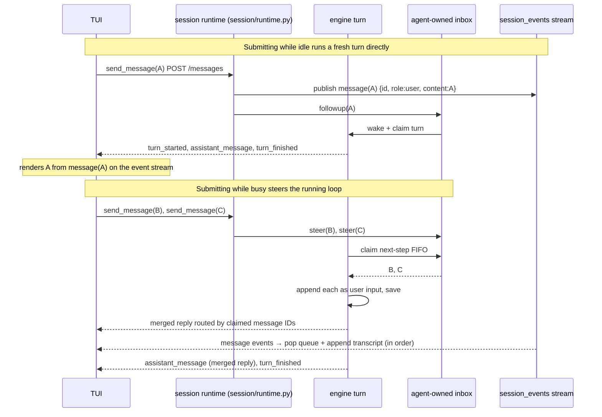

# XBotv2 Protocol

## Transport

XBotv2 uses HTTP JSON endpoints plus SSE streams for the active C/S path.
Local TUI mode can spawn the same HTTP server behind a Unix domain socket.

- **Unix Domain Socket** (default for local TUI): auto-generated at
  `/tmp/xbotv2-{pid}.sock`. Server subprocess spawned and bound to it.
  No TCP port needed. Socket cleaned up on exit.

- **HTTP/SSE** (TCP): `--server URL` connects the TUI to an existing server.
  Server mode binds `--bind`:`--port` (default `127.0.0.1:4096`). Non-loopback
  bind is rejected until authentication exists.

TUI transport is selectable at startup:
```bash
xbot tui                           # UDS (default)
xbot tui --server http://..        # attach to HTTP/SSE server
xbot serve                         # server-only on 127.0.0.1
```

Local Web mode also uses a generated UDS for its API subprocess by default,
but browsers never access that socket directly. A loopback Python Web server
serves the compiled HTML/JS and proxies same-origin `/api/*` requests to the
UDS after removing the `/api` prefix. Both normal JSON responses and SSE streams
retain the API status, content type, and body. The API subprocess and socket are
removed when Web mode exits.

```bash
xbot web                           # compiled Web + automatic UDS API
xbot web --server http://127.0.0.1:4096
```

`--server` and `--uds` are mutually exclusive. The second form proxies an
existing HTTP API instead of spawning one. The browser-facing server binds
only to `127.0.0.1` while authentication is unavailable.

## Session

A session is a persistent container with one main thread and zero or more
subagent threads. Live runtimes are addressed by `(session_id, thread_id)`;
opening or closing one subagent thread does not replace the main thread.
Thread status and history remain queryable after its runtime closes.

### Modes

- `new`: create session, generate session_id if not provided
- `resume`: attach to an active thread, or reconstruct an inactive persisted thread
- `new` with an existing explicit id returns HTTP 409; `resume` with a missing
  id returns HTTP 404. Resume never replaces an active same-process runtime.
  Requested provider/workspace overrides do not reconfigure an active thread;
  the response reports the runtime's authoritative values.
- The CLI treats an explicit TUI `--session` as `resume`; omitting it creates a
  new generated session. Programmatic clients continue to send the mode
  explicitly.
- `OpenSessionResponse.history` contains display-safe user, assistant, and tool
  messages as typed `SessionHistoryItem` values. It excludes system messages
  and private provider metadata. Tool history retains structured `data`,
  `error`, and `artifacts` so resumed clients render the same Details content
  as the live event stream.
- Clients may set `history_limit` while opening a session or thread. The
  response then contains the newest page and `history_cursor`; older pages are
  read with `GET .../messages?limit=<n>&cursor=<cursor>`. Cursors address the
  persisted ordering and pages remain chronological. Clients treat cursors as
  opaque. Appending messages does not disturb an existing backward traversal;
  replacing history through clear, undo, regenerate, or compaction invalidates
  old cursors with `invalid_cursor`.
- Plugin/runtime inputs retain `runtime.source` and `runtime.event` in the
  display projection. Clients must label these as injected context rather than
  presenting them as human-authored messages.
- `OpenSessionResponse.model`, `model_mode`, and `context_window` describe the
  active provider model, its explicitly configured reasoning/thinking mode, and
  the runtime context budget. An empty `model_mode` means the provider did not
  configure one; XBot does not invent a default mode. Provider selection is
  persisted in thread metadata and restored by `resume`.
- `status_slots` is a compact `dict[str, str]` supplied by loaded plugins for
  human status displays. It appears on open/thread responses and turn-finished
  events. The Goal plugin exposes its current state as the `goal` slot.
- `OpenSessionResponse.usage` restores cumulative session token totals and the
  latest main-Agent provider-reported `context_tokens`. Auxiliary model calls
  contribute to cumulative session usage without replacing it. Live `usage`
  events are per-model-
  call deltas; clients add them to the restored totals.
  `input_tokens` excludes cache reads and cache creation reported in their
  dedicated fields; `total_tokens` includes all processed input and output.
  The usage capability persists a strict snapshot under the shared
  `StateService` namespace `usage`, so compact, clear, undo, and history
  replacement do not erase token accounting.
- Protocol/configuration text is UTF-8. Clients do not attempt Latin-1 or
  CP1252 repair when text is already decoded.
- More than one client may subscribe to the same thread event stream. Each
  receives the same runtime events; disconnecting one subscription has no
  effect on the others or on a running turn.

### Endpoints

| Method | Path | Purpose |
|---|---|---|
| GET | `/health` | Health check |
| GET | `/providers` | List provider names and non-secret capabilities |
| POST | `/hello` | Client handshake |
| GET | `/workspaces/events?after={cursor}` | Replay and follow Workspace-owned Session/Workspace catalog changes |
| GET | `/workspaces` | List durable Workspaces in user-defined order with current session membership |
| POST | `/workspaces` | Register an existing filesystem directory as a Workspace |
| PATCH | `/workspaces/{wid}` | Rename a Workspace without renaming its directory |
| DELETE | `/workspaces/{wid}` | Remove the registry entry without deleting sessions or files |
| POST | `/workspaces/{wid}/order` | Insert a Workspace before another id, or last when the anchor is null |
| POST | `/workspaces/{wid}/sessions/{sid}/order` | Insert an accounted session before another session, or last when the anchor is null |
| POST | `/sessions` | Open session (new/resume) |
| GET | `/sessions` | List persisted sessions and runtime status |
| GET | `/sessions/{sid}` | Read one session summary |
| PATCH | `/sessions/{sid}` | Rename the session by updating its main-thread metadata |
| PUT | `/sessions/{sid}/archive` | Hide a session from active Workspace groups without deleting it |
| DELETE | `/sessions/{sid}/archive` | Restore an archived session to its Workspace group |
| DELETE | `/sessions/{sid}` | Close and permanently delete a persisted session |
| POST | `/sessions/{sid}/fork` | Copy persisted session state to a new id |
| GET | `/sessions/{sid}/policy` | Read session-local policy rules |
| PATCH | `/sessions/{sid}/policy` | Update session-local permission and sandbox rules |
| GET | `/sessions/{sid}/threads` | List main and subagent threads |
| POST | `/sessions/{sid}/threads` | Open a new or persisted subagent thread |
| GET | `/sessions/{sid}/threads/{tid}` | Read thread status and usage |
| GET | `/sessions/{sid}/threads/{tid}/agents` | List workspace-visible Agents |
| PUT | `/sessions/{sid}/threads/{tid}/agent` | Select the active Primary Agent |
| PUT | `/sessions/{sid}/threads/{tid}/provider` | Select and persist the provider |
| PUT | `/sessions/{sid}/threads/{tid}/effort` | Switch the reasoning effort tier |
| GET | `/sessions/{sid}/threads/{tid}/tools` | List model-visible Tool schemas |
| GET | `/sessions/{sid}/threads/{tid}/messages` | Read display-safe history |
| POST | `/sessions/{sid}/threads/{tid}/messages` | Send message, receive turn SSE |
| GET | `/sessions/{sid}/threads/{tid}/artifacts/{artifact_id}` | Read a history-referenced thread artifact |
| POST | `/sessions/{sid}/threads/{tid}/history/clear` | Clear conversation history |
| POST | `/sessions/{sid}/threads/{tid}/history/undo` | Undo complete user turns |
| POST | `/sessions/{sid}/threads/{tid}/history/regenerate` | Replace and rerun the latest human turn as SSE |
| GET | `/sessions/{sid}/threads/{tid}/todos` | Read the Todo plugin's authoritative snapshot |
| GET | `/sessions/{sid}/threads/{tid}/events?after={cursor}` | Replay and follow server-initiated runtime events |
| GET | `/sessions/{sid}/threads/{tid}/tasks` | List shell and subagent tasks |
| POST | `/sessions/{sid}/threads/{tid}/tasks/{task_id}/stop` | Stop one task idempotently |
| POST | `/sessions/{sid}/threads/{tid}/tasks/stop` | Stop all running tasks |
| POST | `/sessions/{sid}/threads/{tid}/interrupt` | Cancel running turn |
| POST | `/sessions/{sid}/threads/{tid}/interactions/permission-response` | Submit permission decision |
| POST | `/sessions/{sid}/threads/{tid}/interactions/user-input` | Submit user input answer |
| POST | `/sessions/{sid}/threads/{tid}/close` | Close one thread runtime |
| POST | `/sessions/{sid}/close` | Close all live runtimes in a session |

`POST .../messages` accepts text plus optional `images` and `attachments`.
Images contain base64 `data` and an `image/*` `media_type` and become native
visual input. Attachments additionally contain a file `name`; the server stores
them under `session/artifacts/attachments/` and gives the Agent a structured
relative reference for filesystem or shell inspection. At least one of text,
images, or attachments is required. Uploaded bytes are not embedded in history.
Assistant history items include persisted `reasoning` when the provider emitted
it. The same field is returned by session resume, message paging, and history
mutation snapshots, so clients render Thinking consistently before and after
reconnect.

`close` never deletes persisted history, artifacts, policy, or plugin state.
`DELETE /sessions/{sid}` is the explicit destructive counterpart: it rejects a
running turn, closes idle runtimes, and removes the complete persisted session.
Slash command transport is not part of the OpenAPI/SDK resource contract.

Workspace identity, order, archived ids, and ordered session membership are
process-level durable state under the Workspace `StateService` namespace.
Session `workspace_root` remains the authority for association. Committed
Session resource events update the ordered Workspace projection immediately;
listing reconciles it against persisted sessions after restart or repair.
Removing a Workspace only removes that registry entry. Registering the same
normalized path again is idempotent and makes its sessions visible under the
new entry.

### Workspace catalog stream

`GET /sessions` and `GET /workspaces` include `event_cursor`. The cursor is
captured before reading the corresponding baseline. A client reads both
baselines, subscribes with `after=min(session_cursor, workspace_cursor)`, and
applies duplicate frames idempotently. This ordering prevents a resource
commit during a baseline query from being missed.

Each `SessionSummary` includes `blank`. It is true only when the persisted main
thread has no messages. Clients may reuse an unarchived blank session in the
selected Workspace instead of creating another empty session. The server emits
`catalog/session-changed` when the first turn makes it non-blank and when a history
mutation makes it blank again.

`GET /workspaces/events?after=N` first sends `catalog/connected` at sequence `N`, then
replays retained frames with larger sequences and follows new commits. The
process keeps a bounded 512-frame window shared by all subscribers. A cursor
outside the current sequence returns `invalid_workspace_event_cursor`; a cursor
older than the replay window returns retryable `workspace_event_cursor_expired`
with `oldest_sequence`, after which the client must obtain new baselines.
Process restart likewise requires new baselines because catalog sequences are not
durable conversation state.

Resource frame types and payloads are:

| Type | Payload |
|---|---|
| `catalog/session-added`, `catalog/session-changed` | `{session: SessionSummary}` |
| `catalog/session-removed` | `{session_id}` |
| `catalog/workspace-changed` | `{workspace: WorkspaceData}` |
| `catalog/workspace-removed` | `{workspace_id}` |
| `catalog/workspace-order-changed` | `{workspace_ids}` |
| `catalog/archived-sessions-changed` | `{archived_session_ids}` |

Frames are emitted only after the owning durable commit. Workspace membership
subscribes to typed Session resource events through XCore; it is not repaired
by an HTTP handler callback or a client refresh side effect.

The session-open body may include `agent` to select a plugin-registered Primary
Agent for a new thread. Resume reads the Agent identity from thread metadata.
Session rename updates the same persisted main-thread metadata used by list,
thread, resume, fork, and ACP projections; no separate session-title index is
maintained.

The typed history, session, Agent, provider, and task endpoints above are the
machine API. Human slash commands remain interactive-client adapters:

- `/undo [count]` removes complete user turns from the persisted tail; `count`
  defaults to one.
- `/clear` removes all message history while preserving the session id, policy,
  artifacts, and plugin state.
- `/fork` copies persisted state, artifacts, plugin state, and policy to a new
  session id. It rejects live turns, interactions, and background tasks rather
  than copying changing runtime state.
- `/agent list` discovers Primary Agents and `/agent use <name>` changes the
  active Agent for subsequent turns without replacing the thread or history.
- `/tasks [ps]` lists live background shell and subagent tasks. `/task stop <id>` and
  `/task stopall` control them without sending command text to the model.

The Goal plugin separately registers the human `/goal` command and the Agent
Tools `create_goal`, `get_goal`, and `update_goal`. The command endpoint invokes
the plugin's command handler directly; it never translates slash text into a
Tool call.

Typed history mutations return `HistoryMutationResponse.messages`, which is the
same display-safe state the next provider request will use.
Regeneration is not client-side resend: the session atomically removes the
latest human-authored turn, retains its text, images, and artifact references,
then runs that input again under the thread turn lock. Injected runtime inputs
are not selected as the human turn.

`OpenSessionResponse.event_cursor` is captured before the response snapshot.
Clients subscribe to `GET .../events?after=<event_cursor>` so events committed
while the snapshot is read are replayed. Each active runtime retains 512 shared
events. Transport reconnect resumes from the last received sequence. A cursor
older than that window returns retryable `session_event_cursor_expired`; a
future cursor returns `invalid_session_event_cursor`.

This shared stream owns accepted inputs, interactions, status/configuration
changes, jobs, and background continuation events. The response for a turn
started by `POST .../messages` remains on that request's SSE stream and the
request connection still owns cancellation. Therefore this cursor is not yet a
durable conversation-turn replay cursor.

## Unified input and response routing

There is no protocol-owned message queue or pending-fold content buffer.
Idle user input uses `followup`; busy user input uses `steer`; background
completion notices use non-waking `inject`. The loop atomically claims
`next-step` input between steps and claims pending `next-step` plus one
`next-turn` input at a turn boundary. The protocol retains only SSE response
waiters keyed by the inbox message ID. Durable `agent/inbox/spliced` records
restore unclaimed input on resume.

### Core ↔ TUI sequence




XBot conversation history uses the provider-neutral roles `system`, `user`,
`assistant`, and `tool`. Human and runtime inputs both use the standard `user`
role, but runtime inputs carry structured source and event metadata in history.
Provider adapters own wire conversion. Messages contain ordered text, reasoning, image, and Tool
call parts; image payloads and uploaded attachments are stored as session
artifacts rather than embedded in the append-only journal. Anthropic can carry
images in Tool results; Chat Completions rejects that non-standard placement.
OpenAI-compatible
requests receive one leading instruction message, while Anthropic receives the
same instruction text through its top-level `system` field and groups adjacent
Tool results into one user content block. OpenAI's `developer` role is a
provider capability, not a portable XBot history role.

## Human UI Command Compatibility

The command catalog exposes registered server commands and prompt expansions
with a `kind` field. It remains outside the generated OpenAPI SDK because it is
a human-interface compatibility plane rather than a machine resource API:

```json
[
  {"name": "goal", "kind": "server", "description": "Manage the session goal"},
  {"name": "find-skills", "kind": "prompt", "description": "Find skills"}
]
```

Kinds: `client` (owned by the interactive client), `server`, and `prompt`.

Each server command registry entry contains human-facing discovery metadata and
an async handler that receives the unparsed argument text. Human syntax belongs
to that command's domain; the protocol does not derive a CLI from JSON Schema.
Server commands execute deterministically outside model history. The component
that owns a command also owns its handler and business state. Interactive
clients may shadow a catalog entry with a client command when the operation has
client lifecycle consequences. In particular, WebUI handles `/session`,
`/resume`, `/new`, `/fork`, `/undo`, and `/clear` through typed session/history
resources so it can switch subscriptions and immediately replace its local
projection. Other server commands use the command endpoint.

A `prompt` entry has metadata but no command handler. The client submits its
original slash text through the message endpoint, where the owning plugin
expands it before the accepted user message enters history. Agent Tools keep
structured JSON-schema inputs and use the Tool runtime. Ordinary Tools and MCP
Tools are not slash commands and are not returned by command discovery.

WebUI merges its client catalog with the server catalog after every session or
thread switch. Client entries win name collisions. Typing `/` opens the
keyboard-accessible command palette; unknown one-line slash commands become
local errors rather than user messages. `/help` opens a searchable directory;
selecting an entry closes the directory and inserts its command into the
composer. Session rows expose fork and confirmed-delete actions without first
resuming that session. Clipboard image items become visible composer
attachments and can be sent without accompanying text. Command results use a
separate bounded, collapsible panel and never enter or scroll the conversation
timeline. A successful server command declares the
resources it changed in `data.effects` (`history`, `thread`, `agents`, `tasks`,
`commands`, or `sessions`). Clients refresh only those authoritative resources;
read-only commands therefore do not rebuild the timeline. Session resume
resolves the real main thread and its persisted workspace, with an optional
explicit workspace override. Active turns cannot be navigated away from until
they finish or are interrupted.

## Stream Events

Every SSE `data:` payload is a `ServerEvent` envelope:

```json
{
  "protocol_version": "v3",
  "session_id": "session-1",
  "thread_id": "agent",
  "request_id": "client-request-1",
  "sequence": 1,
  "type": "assistant_message",
  "data": {"content": "hello"}
}
```

The SSE `event:` field is the same value as envelope `type`. The SSE `id:`
field is the same value as envelope `sequence`.

`MessageRequest.request_id` is the correlation key for one submitted message
and its turn. The server generates `req-<uuid>` when the client sends an empty
value. That final id is passed to `Engine.run_turn`, exposed on every
turn-scoped `EventContext`, and copied to every SSE envelope emitted for the
request, including errors and `end`.

Interaction ids are a separate namespace and lifecycle. For example, a
`permission_request` event has the turn correlation id in the outer envelope
and the pending permission id in `data.request_id`. Clients respond using the
inner interaction id while continuing to correlate the stream using the outer
turn id. Interaction ids are opaque: clients associate acknowledgements with
the request event they observed and must not parse prefixes or derive tool-call
ids from them.

Both sides use `protocol.sse` for the wire format. The server encodes a
validated `ServerEvent`; the client incrementally decodes SSE messages and then
validates their JSON payload as `ServerEvent`. UI code only receives validated
event dictionaries and does not parse SSE lines itself. `TerminalSession`
consumes the final `end` sentinel, so UI reducers receive domain events only.

| Event | Data |
|---|---|
| `turn_started` | `{turn}` |
| `turn_finished` | `{turn}` |
| `turn_cancelled` | `{turn, reason}` |
| `input_rejected` | `{reason, request_id}` |
| `assistant_message_delta` | `{content}` or `{reasoning}` |
| `assistant_message` | `{content, tool_calls}` |
| `tool_call_delta` | `{tool_calls: [{tool_call_id, id, name, args_delta, args, index, replaces_tool_call_id?}]}` |
| `tool_calls_started` | `{tool_calls: [{id, name, args, type}]}` |
| `tool_result` | `{tool_call_id, name, content, status, data?, error?, artifacts?}` |
| `permission_denied` | `{request_id, reason, tool_call, decision}` |
| `permission_request` | `{request_id, source, reason, tool_call, decision, resume_supported}` |
| `permission_response_recorded` | `{request_id, status, decision, scope, answer, pending_interactions}` |
| `user_input_required` | `{request_id, source, tool_call_id, question, options, timeout_seconds, resume_supported}` |
| `user_input_recorded` | `{request_id, status, decision, scope, answer, pending_interactions}` |
| `usage` | `{input_tokens, output_tokens, total_tokens, requests, context_tokens, cache_read_input_tokens, cache_creation_input_tokens, prompt_cache_write_tokens}` |
| `error` | `{code, message, details?, retryable?, stage?}` |
| `end` | `{status}` |

The protocol-core event DTOs above live in `protocol.models`. During the
typed outbound-event migration, capability-owned stream events may also pass
through the SSE carrier. Their payload contracts remain owned by the producing
capability rather than by a parallel server registry:

| Event | Data | DTO owner |
|---|---|---|
| `agent_configured` | `{agent_name?, provider?, model?, model_mode?, context_window?}` | Agent/session producer |
| `client_message` | `{message, level, source, tool_call_id}` | Session producer |
| `history_updated` | `{history, operation, turns, history_cursor?}` | Session producer |
| `compaction_started` | `{reason, messages_before, history_chars_before, context_tokens_before, context_limit}` | Compact producer |
| `compaction_completed` | `{reason, metrics}` | Compact producer |
| `compaction_failed` | `{reason, message}` | Compact producer |
| `task_updated` | `{task_id, kind, command, cwd, status, created_at, started_at, finished_at, output, error, agent?, thread_id?, usage?}` | `XBotv2.protocol.models` (shared with `TaskListResponse`) |

`ServerEvent` validates protocol-core payloads before framing. Unknown
capability events currently retain their payload unchanged; producers must
publish their declared payload type. This transitional behavior will be
replaced by typed producer-owned outbound events.

After `turn_started`, the stream emits exactly one turn terminal event:
`turn_finished` for normal or failed completion, or `turn_cancelled` for an
interrupt. A failed turn emits its diagnostic `error` immediately before
`turn_finished`; clients retain the error status while clearing active-turn
state. `end` is a transport sentinel indicating that the SSE response closed
cleanly. Its `status` does not describe the semantic outcome of the turn.

The protocol core event inventory lives in
`protocol.models.KNOWN_SERVER_EVENT_TYPES`. Golden SSE fixtures live under
`XBotv2/tests/fixtures/sse/`.

## Agent-Initiated Interaction

`permission_request` and `user_input_required` are blocking server-to-client
requests. Their shared lifecycle is:

1. The engine registers the interaction `request_id`.
2. The server publishes the request on the active message SSE stream.
3. The client submits a response to the matching interaction endpoint.
4. The server publishes `permission_response_recorded` or
   `user_input_recorded` on the original stream.
5. Tool execution resumes with the decision or answer.

Registration happens before publication, so a client may respond immediately
after receiving the request. Repeated or stale responses return HTTP 410.
The client must continue consuming the SSE stream while local input is pending;
it submits the response independently through the interaction endpoint. A turn
terminal event invalidates any unanswered request.
Permission responses accept `allow` or `deny` with `once` or `session` scope.
User-input responses accept an arbitrary JSON-compatible `answer`. `ask_user`
requires at least two `{label, description}` choices and returns the selected
label; other interaction sources may request free-form input. The timeout, when
present, is positive.

The Agent-facing `request_permission` Tool emits the same
`permission_request` event with a `permission` object containing an exact Tool
name and full-match parameter regular expressions. It does not fabricate or
execute a future ToolCall, and it does not define another Tool dispatch path.
An allow-once rule is consumed by the next matching call.

Because `ask_user` is a registered tool, permission policy runs first. Under an
`ask` policy, one turn therefore carries two ordered interactions:
`permission_request`, then `user_input_required`. The client must resolve each
request by its own id and continue consuming the same SSE stream.

The protocol DTO inventory for this family is:

- `PermissionResponseRequest` and `UserInputResponseRequest` for HTTP bodies;
- `PermissionRequestData` and `UserInputRequiredData` for blocking SSE events;
- `InteractionRecordedData` for the two response-recorded events.

Stable non-interaction event DTOs currently include `ToolResultData`,
`UsageData`, `ErrorEventData`, `TurnData`, `TurnCancelledData`,
`AssistantMessageData`, `AssistantMessageDeltaData`, `ToolCallData`,
`ToolCallDeltaData`, and `ToolCallsStartedData`. Capability-owned event DTOs
(`ClientMessageData`, `HistoryUpdatedData`, `AgentConfiguredData`,
`CompactionStartedData`, `CompactionCompletedData`, `CompactionFailedData`)
live in the owning packages and are registered through the server event
registry. HTTP failures
use `ErrorResponse`; all HTTP exception handlers serialize through that model
and always return `code`, `message`, `details`, and `retryable`.

`ServerEvent` validates every current event payload at construction and decode
boundaries. `TYPED_SERVER_EVENT_TYPES` must cover the complete
`KNOWN_SERVER_EVENT_TYPES` inventory. A malformed payload decodes as an
`sse_decode_error` event instead of terminating the client stream.

Error codes remain strings rather than an enum. The current server-owned
inventory is:

- HTTP: `invalid_request`, `interaction_no_longer_pending`,
  `parent_thread_not_active`, `session_busy`, `session_exists`,
  `session_not_found`, `session_open_failed`, `thread_not_active`,
  `unsupported_protocol`;
- SSE: `engine_busy`, `engine_error`, `hook_short_circuit_rejected`,
  `sse_decode_error`, `stream_failed`, `turn_failed`,
  `user_message_rejected`.

Unexpected engine exceptions use `engine_error` and carry the Python exception
class in `details.exception_type`; class names are not wire error codes. Hooks
may emit extension-defined string codes, so this inventory is a maintained
behavior list rather than a closed enum.

Interaction recovery after an SSE disconnect is not supported. Request events
therefore carry `resume_supported: false`; disconnect cancels the live wait,
stops the affected turn, and destroys its runtime. The engine appends error tool
results for calls left unanswered by that interruption, so a new runtime can
resume the valid persisted history. Old interaction request IDs remain invalid.

The HTTP turn bridge owns and explicitly closes the Engine async stream on
normal completion, interrupt, and disconnect.

## Provider Events (internal)

`_model_response` event carries an aggregated `ModelResponse` with ordered
parts, usage metadata, response metadata, and provider-neutral text,
reasoning, and Tool-call projections.
